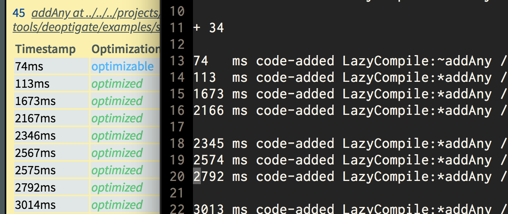

# Code Events

### Internal Code Events

- [code-events.h](https://cs.chromium.org/chromium/src/v8/src/code-events.h?q=code-creation&sq=package:chromium&g=0&l=28)
  - mainly interesting:
    - 'code-creation': `CODE_CREATION_EVENT`
    - 'code-move': `CODE_MOVE_EVENT`
    - 'code-delete': `CODE_DELETE_EVENT`
    - 'sfi-move': `SHARED_FUNC_MOVE_EVENT`
- all go through the `CODE_EVENT_DISPATCH(code)` defined in `code-events.h`
- `CodeEventDispatcher` (`code-events.h`) allows adding listeners to code events
- `log.cc` `Logger::AddCodeEventListener(CodeEventListener* listener)` calls that method
- logger is initialized inside `isolate.cc` `Isolate::Init`, so for now we should init our
  `CodeEventListener` there as well

#### CODE-CREATION-EVENT

- handled via internal event callback [inside
  log.cc](https://cs.chromium.org/chromium/src/v8/src/log.cc?q=CODE_CREATION_EVENT&sq=package:chromium&g=0&l=1176)
- called via `LOG_CODE_EVENT` macro defined in `log.h`
- `LOG_CODE_EVENT` is invoked from
  - `code-generator.cc`
  - `liveedit.cc`
  - `heap-inl.h`
  - `bytecode-array-writer.cc`
  - `builtin-serializer.cc`
  - `startup-serializer.cc`
  - `wasm-code-manager.cc`

#### CODE-MOVE-EVENT

- handled via `CodeMoveEvent` [inside
  log.cc](https://cs.chromium.org/chromium/src/v8/src/log.cc?q=CODE_MOVE_EVENT&sq=package:chromium&g=0&l=1412)

### Jit Code Events

- [JitCodeEvent](https://cs.chromium.org/chromium/src/v8/include/v8.h?q=JitCodeEvent&sq=package:chromium&g=0&l=6779)
```
CODE_ADDED,
CODE_MOVED,
CODE_REMOVED,                   // removal events are not currently issued
CODE_ADD_LINE_POS_INFO,
CODE_START_LINE_INFO_RECORDING,
CODE_END_LINE_INFO_RECORDING
```

### JitLogger Events from Code Events

- the
  [JitLogger](https://cs.chromium.org/chromium/src/v8/src/log.cc?sq=package:chromium&g=0&l=627)
  listens to CodeEvents and emits `JitCodeEvent`s
- the relationship between properties can easily be seen here

#### CODE-ADDED

```cc
// JitLogger::LogRecordedBuffer(AbstractCode* code,
//                              SharedFunctionInfo* shared, const char* name,
//                              int length)

event.type       = JitCodeEvent::CODE_ADDED
event.code_start = code->InstructionStart()
event.code_type  = JitCodeEvent::JIT_CODE || JitCodeEvent::BYTE_CODE
event.code_len   = code->InstructionSize()
event.script     = shared_function_handle
event.name.str   = name
event.name.len   = length
```

#### CODE-MOVED

```cc
// JitLogger::CodeMoveEvent(AbstractCode* from, AbstractCode* to)

event.type           = JitCodeEvent::CODE_MOVED
event.code_start     = code->InstructionStart()
event.code_type      = JitCodeEvent::JIT_CODE || JitCodeEvent::BYTE_CODE
event.code_len       = from->InstructionSize()
event.new_code_start = to->InstructionStart()
```

#### CODE-ADD-LINE-POS-INFO

```cc
// JitLogger::AddCodeLinePosInfoEvent(
//     void* jit_handler_data,
//     int pc_offset,
//     int position,
//     JitCodeEvent::PositionType position_type)

event.type                    = JitCodeEvent::CODE_ADD_LINE_POS_INFO
event.user_data               = jit_handler_data
event.line_info.offset        = pc_offset
event.line_info.pos           = position
event.line_info.position_type = position_type
```

#### CODE-START-LINE-INFO-RECORDING

```cc
// JitLogger::StartCodePosInfoEvent()
event.type = JitCodeEvent::CODE_START_LINE_INFO_RECORDING
```

#### CODE-END-LINE-INFO-RECORDING

```cc
// JitLogger::EndCodePosInfoEvent(Address start_address,
//                                void* jit_handler_data)

event.type       = JitCodeEvent::CODE_END_LINE_INFO_RECORDING
event.code_start = start_address
event.user_data  = jit_handler_data
```

## Collecting CodeInfo via JitLogger events

```cc
std::chrono::system_clock::time_point process_start;

uint64_t get_timestamp_ms() {
  auto now = std::chrono::system_clock::now();
  std::chrono::duration<double> diff = now - process_start;
  return uint64_t(diff.count() * 1E3);
}

class CodeInfo {
  public:
  CodeInfo(const JitCodeEvent& event) {
    code_start = event.code_start;
    code_len = event.code_len;

    const size_t name_len = event.name.len;
    name = new char[name_len + 1];
    std::strncpy(name, event.name.str, name_len);
    name[name_len] = '\0';

    time_stamp = get_timestamp_ms();

    is_jit = event.code_type == JitCodeEvent::JIT_CODE;

    // ignoring event.script
  }

  void add_line_info(JitCodeEvent::line_info_t line_info) {
    line_offset = line_info.offset;
    line_pos = line_info.pos;
  }

  void dump(const char* event_type) {
    fprintf(stderr, "%-5lldms %s %s [%ld:%ld] [%p:%ld] %s\n",
      time_stamp,
      event_type,
      name,
      line_pos,
      line_offset,
      code_start,
      code_len,
      is_jit ? "jit" :"byte code"
    );
  }

  void* code_start;
  size_t code_len;
  char* name;
  bool is_jit;
  uint64_t time_stamp;

  size_t line_offset = 0;
  size_t line_pos = 0;
};

std::map<void*, CodeInfo*> code_infos;

bool is_user_code(const char* name, const size_t len) {
  // poor man's check, basically we're looking for a / which indicates
  // that the name included a path
  for (size_t i = 0; i < len; i++) {
    if (name[i] == '/') return true;
  }
  return false;
}

void tk_jitCodeHandler(const JitCodeEvent* event) {
  switch (event->type) {
    case JitCodeEvent::EventType::CODE_ADDED: {
      if (!is_user_code(event->name.str, event->name.len)) return;

      CodeInfo* code_added = new CodeInfo(*event);
      code_infos.insert(
        std::pair<void*, CodeInfo*>(code_added->code_start, code_added)
      );
      code_added->dump("code-added");
      break;
    }
    case JitCodeEvent::EventType::CODE_MOVED: {
      // we only track user code infos
      if (code_infos.count(event->code_start) <= 0) return;
      CodeInfo* code_info = code_infos[event->code_start];

      CHECK_NOT_NULL(code_info);

      // Move the code_info to a different key in the map
      code_infos.erase(code_info->code_start);
      code_info->code_start = event->new_code_start;
      code_infos.insert(
        std::pair<void*, CodeInfo*>(code_info->code_start, code_info)
      );
      code_info->dump("code-moved");
      break;
    }

    // LINE_INFO events are ignored as we don't need that info
    case JitCodeEvent::CODE_START_LINE_INFO_RECORDING: {
      break;
    }
    case JitCodeEvent::EventType::CODE_ADD_LINE_POS_INFO: {
      break;
    }
    case JitCodeEvent::CODE_END_LINE_INFO_RECORDING: {
      break;
    }

    default:
      // ignore other events
      ;
  }
}

// [ .. ]

int Shell::Main(int argc, char* argv[]) {
  // [ .. ]

  process_start = std::chrono::system_clock::now();
  isolate->SetJitCodeEventHandler(
      JitCodeEventOptions::kJitCodeEventEnumExisting,
      tk_jitCodeHandler);

  // [ .. ]
}
```

### Comparing with Deoptigate

This gives us similar optimization results to what we get with deoptigate, our timestamps were
off by 34ms, but once we adjust that the relationship becomes clear:


